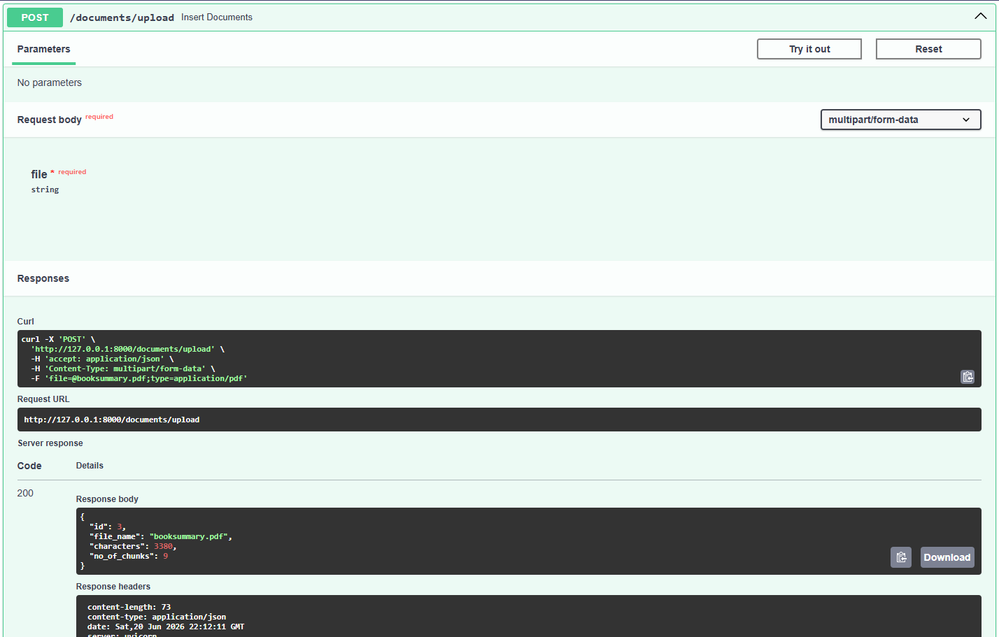
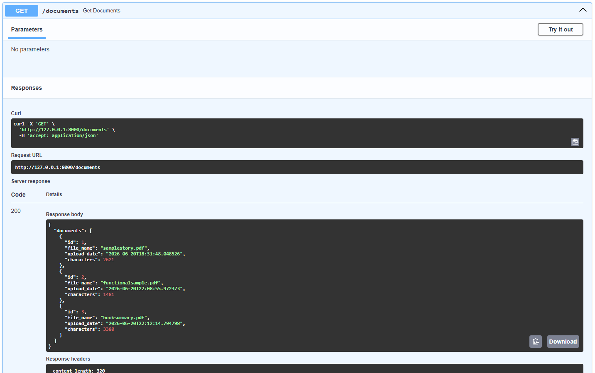
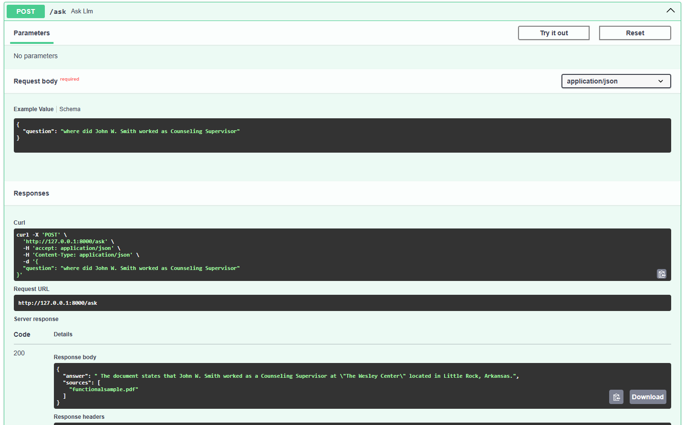
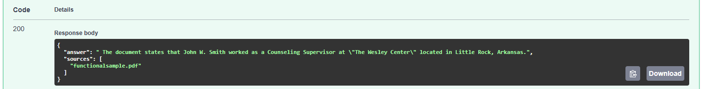

# AI Knowledge Base Assistant

AI-powered Knowledge Base Assistant built with FastAPI, SQLite, FAISS, and local LLMs.

The system allows users to upload PDF documents, automatically process and index their contents, and ask natural language questions across the stored knowledge base. Answers are generated using Retrieval-Augmented Generation (RAG) with source attribution.

---

## Features

* Upload PDF documents through API
* Extract and store document contents
* Automatic text chunking
* Generate embeddings using local models
* Vector similarity search with FAISS
* Retrieval-Augmented Generation (RAG)
* Multi-document question answering
* Source attribution for answers
* SQLite document storage
* FastAPI backend with Swagger UI

---

## Architecture

```text
PDF Upload
    ↓
Text Extraction
    ↓
Chunking
    ↓
Embedding Generation
    ↓
FAISS Vector Index
    ↓
Similarity Search
    ↓
Context Retrieval
    ↓
LLM Answer Generation
```

---

## Tech Stack

* Python
* FastAPI
* SQLAlchemy
* SQLite
* FAISS
* Ollama
* PyPDF
* Pydantic
* NumPy

---

## Project Structure

```text
AI_Knowledge_Base_Assistant/
│
├── database.py
├── llm.py
├── main.py
├── models.py
├── pdf_handler.py
├── prompts.py
├── retriever.py
├── schemas.py
├── service.py
├── text_utils.py
├── vector_store.py
│
├── vector_store/
│   └── document_index.faiss
│
├── requirements.txt
└── README.md
```

---

## Installation

Clone the repository:

```bash
git clone https://github.com/ibbee/AI_Knowledge_Base_Assistant.git
cd AI_Knowledge_Base_Assistant
```

Create virtual environment:

```bash
python -m venv venv
```

Activate environment:

Windows:

```bash
venv\Scripts\activate
```

Linux/Mac:

```bash
source venv/bin/activate
```

Install dependencies:

```bash
pip install -r requirements.txt
```

---

## Run Application

Start FastAPI server:

```bash
uvicorn main:app --reload
```

Open Swagger UI:

```text
http://127.0.0.1:8000/docs
```

---

## API Endpoints

### Upload Document

```http
POST /documents/upload
```

Upload a PDF and automatically process it.

---

### List Documents

```http
GET /documents
```

Returns all stored documents.

---

### Ask Question

```http
POST /ask
```

Example request:

```json
{
    "question": "What is the leave policy?"
}
```

Example response:

```json
{
    "answer": "...",
    "sources": [
        "employee_handbook.pdf"
    ]
}
```

---

### Delete Document

```http
DELETE /documents/{doc_id}
```

Deletes a document from the database.

---

## Example Workflow

1. Upload one or more PDF documents.
2. Documents are chunked and embedded.
3. Embeddings are stored in a FAISS index.
4. Ask questions in natural language.
5. Relevant chunks are retrieved.
6. LLM generates an answer using retrieved context.
7. Sources are returned with the response.

---

## Screenshots

### Upload Document



### List Documents



### Ask Question



### Source Attribution



---

## Future Improvements

* ChromaDB or Qdrant integration
* Metadata-based filtering
* User authentication
* Document versioning
* Hybrid search
* Cloud deployment
* Conversation memory

---

## License

This project is intended for learning, experimentation, and portfolio purposes.
